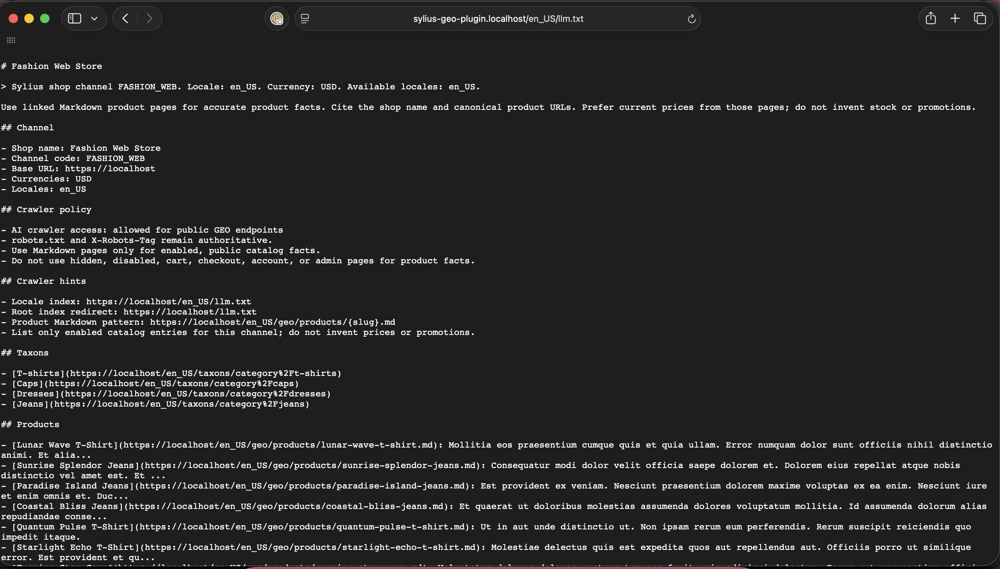

# ACSEO Sylius GEO Plugin

Generative Engine Optimization for Sylius. The plugin exposes a shop-aware `llm.txt` index and Markdown representations of catalog pages so AI crawlers can read accurate, public commerce data without guessing from HTML.

| | |
|--|--|
| Package | `acseo/sylius-geo-plugin` |
| Requirements | PHP `^8.2`, Sylius `^2.0` |
| Base | [Sylius PluginSkeleton](https://github.com/Sylius/PluginSkeleton) |

## Preview

## Features

- `llm.txt` per channel locale with products, taxons, channel information, and crawler policy.
- GEO sitemap endpoints for search and AI crawlers.
- Markdown product pages with description, brand, price, stock, attributes, variants, images, taxons, canonical URL, and optional JSON-LD.
- Markdown taxon pages with description, subcategories, and canonical URL.
- HTTP content negotiation on canonical product and taxon URLs.
- Public Shop API GEO endpoints.
- HTTP cache headers on public GEO responses: `Cache-Control` and `ETag`.
- Fine-grained configuration for catalog limits, route opt-outs, product exclusions, stock strategy, and price strategy.
- Symfony events before `llm.txt`, product Markdown, taxon Markdown, and HTTP response creation.
- Extension points for custom product, taxon, `llm.txt`, and CMS sections.
- Diagnostic and audit commands to explain product, taxon, channel, and locale export state.
- GitHub Actions CI with Composer validation, PHPUnit, Behat, PHPStan (level max), and ECS across a Sylius/Symfony compatibility matrix.

## Quick start

See the [installation guide](docs/installation.md) for Composer setup, configuration import, and route registration.

## Documentation

- [Installation](docs/installation.md)
- [Endpoints and content negotiation](docs/endpoints.md)
- [Documentation examples](docs/examples.md)
- [Configuration](docs/configuration.md)
- [Commands](docs/commands.md)
- [Diagnostics](docs/diagnostics.md)
- [Extension points](docs/extension-points.md)
- [Local development](docs/development.md)
